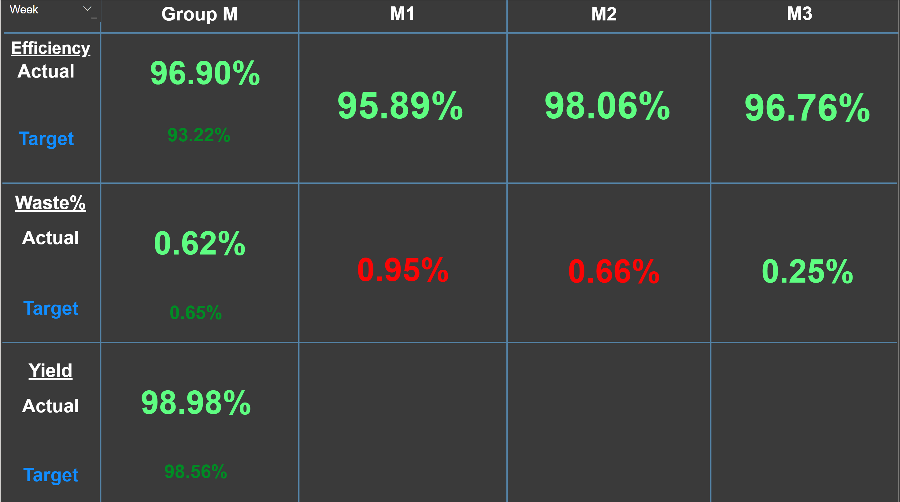
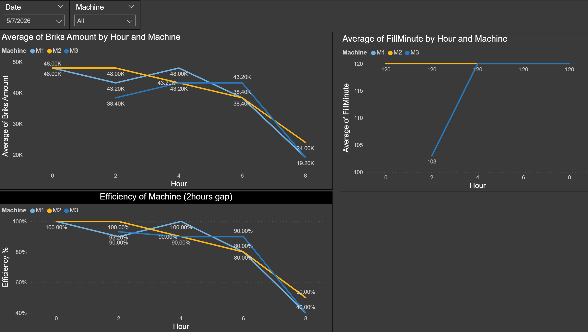
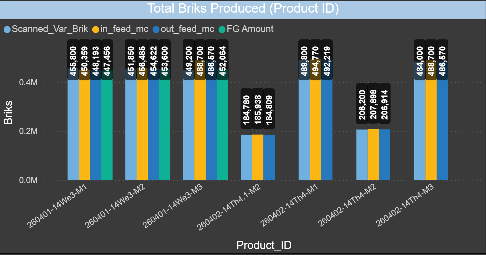

# Dashboard

Power BI KPI dashboard for monitoring production performance across Group M machines (M1, M2, M3) at DairyPlus Co., Ltd. Reviewed weekly at director level.

---

## Dashboard Pages

### KPI Scorecard
Weekly summary of Efficiency, Waste%, and Yield — actual vs. target — per machine and group aggregate. Color coded: **green** = on or below target, **red** = over target.

| KPI | Group M | M1 | M2 | M3 |
|---|---|---|---|---|
| Efficiency (Actual) | 96.90% | 95.89% | 98.06% | 96.76% |
| Efficiency (Target) | 93.22% | 93.22% | 93.22% | 93.22% |
| Waste% (Actual) | 0.62% | 0.95% 🔴 | 0.66% 🔴 | 0.25% |
| Waste% (Target) | 0.65% | 0.65% | 0.65% | 0.65% |
| Yield (Actual) | 98.98% | — | — | — |
| Yield (Target) | 98.56% | — | — | — |

> **Note on Yield:** Yield is tracked at Group M level only. The preparation department sends a single batch quantity to the filling section — M1, M2, M3 share that batch. Yield variance is therefore a group metric, not per-machine.



---

### Hourly Machine Performance
Three line charts filtered by date and machine, showing intra-shift trends across hours 0–8:

- **Average Briks Amount by Hour** — output volume per machine per hour (M1/M2/M3 peaking at ~48K briks/hour); later hours show less data as the shift is still in progress, not a performance drop
- **Average FillMinute by Hour** — machine fill time in minutes; M2 flat at 120min, M1 dipped to 103min at hour 2 then recovered, M3 flat at 120min
- **Efficiency of Machine (2-hour gap)** — efficiency % recalculated every 2 hours; data toward the right reflects an ongoing shift with fewer completed cycles, not a decline in machine performance



---

### Total Briks by Product
Clustered bar chart showing production volume per product run (Product_ID format: `YYMMDD-Line-Machine`). Four metrics tracked per run:

| Metric | Description |
|---|---|
| `Scanned_Var_Brik` | Briks counted at scanner |
| `in_feed_mc` | Infeed counter from machine |
| `out_feed_mc` | Outfeed counter from machine |
| `FG Amount` | Finished goods confirmed |

Comparing these four values per batch surfaces discrepancies between machine counters and actual FG output — used for yield variance and waste root cause analysis.



---

## Data Sources

| Source | Description |
|--------|-------------|
| `T_M_Filler_Process` | Live PLC machine state — step number, fill minutes, running signals |
| `Change paper brik` | Paper roll change events with splice times and feed counter snapshots |
| Production batch tables | Product_ID, planned vs. actual yield, FG amount |

Data pulled directly from the factory SQL Server database.

---

## Key DAX Measures

```
Machine Efficiency = DIVIDE([Total FG Output], [Total TBA Running Hours])

Waste %            = DIVIDE([Total Waste], [Total Production], 0)

Yield Variance     = [Actual Yield] - [Expected Yield]
```

---

## Files

| File | Description |
|------|-------------|
| `pbix/manufacturing-kpi-dashboard.pbix` | Main Power BI report file |
| `screenshots/kpi-scorecard.png` | Weekly KPI scorecard — efficiency, waste%, yield vs. target |
| `screenshots/hourly-machine-performance.png` | Hourly briks, fill minutes, efficiency trend |
| `screenshots/total-briks-by-product.png` | Briks breakdown by product run (scanned, infeed, outfeed, FG) |
| `sql/` | Source queries used in the data model |
